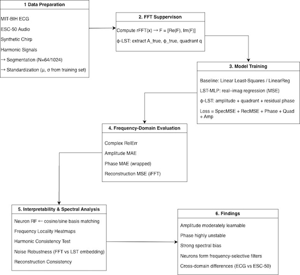

# MIS583-FFT-LST-Project
MIS583 深度學習應用 期末專題報告
Group No.11  Team Member：王淵司（Wang Yuan Shih）Student ID：D134020001 授課教師：楊惠芳教授
# Toward Learnable Spectral Transforms:  MLP Approximation and Spectral Bias Analysis of the Fast Fourier Transform

This project investigates whether multilayer perceptrons (MLPs) can learn the The Fast Fourier Transform (FFT) is a spectral operator. We reformulate FFT prediction as supervised spectral learning and train two models—LST-MLP and φ-LST—to approximate amplitude and phase across structured ECG and broadband ESC-50 audio. The approach integrates FFT supervision, frequency-resolved error analysis, and receptive-field interpretation.
    
Experiments show that amplitude is learnable, but phase suffers from instability, discontinuities, and large high-frequency errors. A clear spectral bias is observed: low frequencies are learned first and most accurately, while high-frequency and phase components remain difficult. Neuron analyses reveal emergent Fourier-like filters, indicating partial internalization of spectral structure.The results demonstrate both the promise and fundamental limits of MLP-based FFT approximatio

